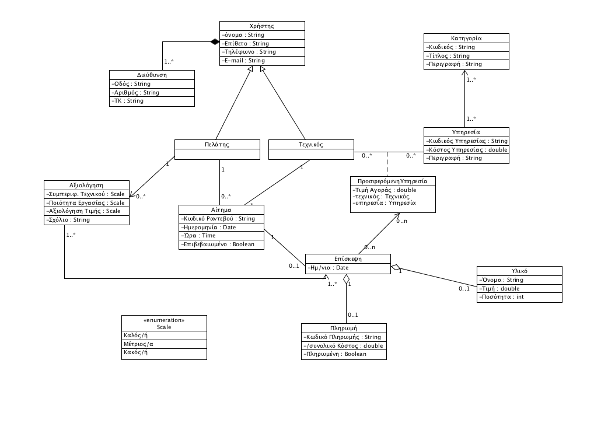

### **2.1.1 Διάγραμμα περιπτώσεων χρήσης**

***

### **2.1.2  Περιγραφή περιπτώσεων χρήσης**

**Α)Εγγραφή πελάτη**

•   Πρωτεύον actor : Πελάτης

•   Ενδιαφερόμενοι :

1. Τεχνικός : Ο τεχνικός ενδιαφέρεται να γνωρίζει τα στοιχεία του πελάτη τα οποία  εισάγει κατά την εγγραφή του προκειμένου να τον εξυπηρετήσει κατάλληλα. (πχ διεύθυνση, τηλέφωνο επικοινωνίας)

•   Προϋποθέσεις:

1. Η μόνη προϋπόθεση είναι ο πελάτης να έχει πρόσβαση στην αρχική σελίδα του   συστήματος, να έχει επιλέξει "πελάτης" και στη συνέχεια "εγγραφή"

**_Βασική Ροή Γεγονότων_**

1. Ο πελάτης επιλέγει να κάνει εγγραφή Πελάτη στο σύστημα (από την αρχική οθόνη)
2. Το σύστημα ζητά από το πελάτης να εισάγει τα απαραίτητα στοιχεία για την εγγραφή.
3. Ο πελάτης εισάγει το Όνομα, το Επίθετο, τη Διεύθυνση κατοικίας, το τηλέφωνό του, το e-mail του και έναν κωδικό πρόσβασης.
4. Το σύστημα ελέγχει για τη εγκυρότητα των στοιχείων.
5. Το σύστημα ενημερώνει για την επιτυχή εγγραφή.

**_Εναλλακτικές Ροές_**

** Σε οποιοδήποτε σημείο το σύστημα καταρρέει.

1. Ο πελάτης εκκινεί το σύστημα.
2. Ο πελάτης ξεκινά τη διαδικασία εγγραφής από την αρχή.

4α. Η μορφή των στοιχείων του χρήστη δεν είναι σωστά.

1. Το σύστημα ενημερώνει τον πελάτη για το ποια στοιχεία δεν έχουν τη σωστή μορφή.
2. Ο πελάτης διορθώνει τα λανθασμένα στοιχεία.
3. Το σύστημα επιστρέφει στον έλεγχο εγκυρότητας των στοιχείων (ροή 4).

**Β)Κλείσιμο ραντεβού**

•   Πρωτεύον actor : Πελάτης

•   Ενδιαφερόμενοι :

1. Τεχνικός : Ο τεχνικός σαφώς και ενδιαφέρεται να μάθει πότε ένας πελάτης κλείνει ραντεβού μαζί του για να μπορεί με τη σειρά του να ανταποκριθεί και να μεταβεί στο χώρο του πελάτη για την επισκευή.

•   Προϋποθέσεις:

1. Η μόνη προϋπόθεση είναι το σύστημα να έχει ταυτοποιήσει τόσο τον πελάτη, όσο και τον τεχνικό ώστε να γίνει η μεταξύ τους επικοινωνία.

**_Βασική Ροή Γεγονότων_**

1. Ο πελάτης αναζητεί τον τεχνικό σύμφωνα με κάποιο κριτήριο ή τον ψάχνει στη λίστα με όλους τους τεχνικούς.
2. Το σύστημα εμφανίζει ταξινομημένα σύμφωνα με κάποιο κριτήριο  τη λίστα με τους τεχνικούς ή σε αλφαβητική σειρά αν δεν έχει επιλεγεί κάποιο.
3. Ο πελάτης επιλέγει τον τεχνικό που τον ενδιαφέρει.
4. Το σύστημα εμφανίζει τις διαθέσιμες ώρες τις οποίες έχει καθορίσει ο τεχνικός κατά την εγγραφή του.
5. Ο πελάτης επιλέγει την την ημέρα και ώρα που τον ικανοποιεί.
6. Το σύστημα στέλνει ειδοποίηση στον τεχνικό.

**_Εναλλακτικές Ροές_**

** Σε οποιοδήποτε σημείο το σύστημα καταρρέει.

1. Ο Πελάτης εκκινεί το σύστημα.
2. Ο Πελάτης ξεκινά τη διαδικασία κλείσιμο ραντεβού από την αρχή.

5α. Ο πελάτης δεν είναι εγγεγραμμένος στο σύστημα.

1. Το σύστημα εμφανίζει κατάλληλο μήνυμα στο πελάτη και του ζητά ή να κάνει εγγραφή ή να δώσει τα στοιχεία εισόδου. 
1α. Ο πελάτης συμπληρώνει τα στοιχεία της εισόδου και εισέρχεταi στο σύστημα ως πιστοποιημένος χρήστης.

1β. Ο πελάτης συμπληρώνει τα στοιχεία εγγραφής πελάτη και εγγράφεται στο σύστημα.

1γ. Ο πελάτης δεν επιλέγει τίποτα από τα δύο.

1. Τερματίζεται η διαδικασία κλεισίματος ραντεβού.

**Γ)Εξόφληση υπηρεσίας**

•   Πρωτεύον actor : Πελάτης

•   Ενδιαφερόμενοι :

1. Τεχνικός : Ο τεχνικός σαφώς και ενδιαφέρεται να μάθει πότε ένας πελάτης      έχει εξοφλήσει την εργασία του αφού πρόκειται για την αμοιβή του.

•   Προϋποθέσεις:

1. Η μόνη προϋπόθεση είναι το σύστημα να έχει ταυτοποιήσει τόσο τον             πελάτη, όσο και τον τεχνικό ώστε να γίνει η μεταξύ τους

**_Βασική Ροή Γεγονότων_**

1. Ο πελάτης επιλέγει τον τεχνικό που θέλει να εξοφλήσει.
2. Το σύστημα εμφανίζει το οφειλόμενο ποσό μαζί με το αναλυτικό τιμολόγιο.
3. Ο πελάτης εισάγει τα τραπεζικά του στοιχεία.
4. Ο πελάτης ολοκληρώνει τη πληρωμή.
5. Το σύστημα προωθεί κατάλληλα τα στοιχείο και το ποσό μεταφοράς στην αρμόδια τράπεζα.
6. Το σύστημα εμφανίζει μήνυμα επιτυχής πληρωμής.

**_Εναλλακτικές Ροές_**

** Σε οποιοδήποτε σημείο το σύστημα καταρρέει και δεν έχει ολοκληρωθεί η διαδικασία εξόφλησης υπηρεσίας.

1. Το σύστημα δεν αποστέλλει τα στοιχεία στη τράπεζα.
2. Ο πελάτης εκκινεί την εφαρμογή.
3. Ο πελάτης ξεκινά τη διαδικασία εξόφλησης υπηρεσίας από την αρχή.

6α. Το στοιχεία που εισήγαγε ο πελάτης δεν ήταν σωστά.

1. Το σύστημα εμφανίζει αν ήταν επιτυχής η εξόφληση και επιστρέφει στη διαδικασία   εισαγωγής των τραπεζικών του στοιχείων (ροή 3)

6β. Το στοιχεία που εισήγαγε ο πελάτης ήταν σωστά αλλά το υπόλοιπο του λογαριασμού  δεν είναι επαρκές

1. Το σύστημα εμφανίζει ανεπιτυχής εξόφληση και τερματίζει.

**Δ)Αξιολόγηση**

•   Πρωτεύον actor : Πελάτης

•   Ενδιαφερόμενοι :

1. Τεχνικός : Ο τεχνικός ενδιαφέρεται να μάθει τις αξιολογήσεις των πελατών             του, τόσο για να βελτιωθεί στο μέλλον αλλά και να έχει μία ένδειξη για την ποιότητα των υπηρεσιών που παρέχει.

•   Προϋποθέσεις:

1. Η μόνη προϋπόθεση είναι το σύστημα να έχει ταυτοποιήσει τον πελάτη για να έχει   πρόσβαση στις αιτήσεις του για επισκευή και να τις αξιολογήσει.

**_Βασική Ροή Γεγονότων_**

1. Ο πελάτης επιλέγει τον τεχνικό που θέλει να αξιολογήσει.
2. Το σύστημα εμφανίζει τα χαρακτηριστικά τα οποία μπορεί ένας πελάτης να αξιολογήσει σε έναν τεχνικό.
3. Ο χρήστης αξιολογεί τα χαρακτηριστικά που επιθυμεί.
4. Ο χρήστης επιβεβαιώνει την αξιολόγηση.

**_Εναλλακτικές Ροές_**

** Σε οποιοδήποτε σημείο το σύστημα καταρρέει και δεν έχει ολοκληρωθεί η διαδικασία αξιολόγησης.

1. Το σύστημα δεν αποστέλλει τα στοιχεία στη τράπεζα.
2. Ο πελάτης εκκινεί την εφαρμογή.
3. Ο πελάτης ξεκινά τη διαδικασία εξόφλησης υπηρεσίας από την αρχή.

**Ε)Εγγραφή Τεχνικού**

•   Πρωτεύον actor : Τεχνικός

•   Ενδιαφερόμενοι :

1. Πελάτης : Ενδιαφέρεται να γνωρίζει τα στοιχεία του τεχνικού προκειμένου να  επιλέξει το κατάλληλο για την βλάβη που έχει και παράλληλα να έχει την δυνατότητα να κάνει συγκρίσεις με σκοπό να βρει τον καλύτερο βασιζόμενος στις αξιολογήσεις.

•   Προϋποθέσεις:

1. Η μόνη προϋπόθεση είναι ο τεχνικός να έχει πρόσβαση στην αρχική σελίδα του συστήματος, να έχει επιλέξει "τεχνικός".

**_Βασική Ροή_**

1. Ο τεχνικός επιλέγει να κάνει εγγραφή Τεχνικού στο σύστημα (από την αρχική οθόνη)
2. Το σύστημα ζητά από το χρήστη να εισάγει τα απαραίτητα στοιχεία για την εγγραφή.
3. Ο Τεχνικός εισάγει το Όνομα, το Επίθετο, τη Διεύθυνση κατοικίας, το τηλέφωνό του, το e-mail του και έναν κωδικό πρόσβασης.
4. Το σύστημα ζητάει από το χρήστη να δηλώσει τη κατηγορία - ειδικότητα που έχει, τις υπηρεσίες τις οποίες εξυπηρετεί, τις εργασίες τις οποίες προσφέρει, τις ημέρες και ώρες τις οποίες είναι διαθέσιμος και τις τιμές που χρεώνει για και υπηρεσία.
5. Το σύστημα ελέγχει για τη εγκυρότητα των στοιχείων.
6. Το σύστημα ενημερώνει για την επιτυχή εγγραφή.

**_Εναλλακτικές Ροές_**

** Σε οποιοδήποτε σημείο το σύστημα καταρρέει.

1. Ο Τεχνικός εκκινεί το σύστημα.
2. Ο Τεχνικός ξεκινά τη διαδικασία εγγραφής από την αρχή.

5α. Η μορφή των στοιχείων του χρήστη δεν είναι σωστά.

1. Το σύστημα ενημερώνει τον τεχνικός για το ποια στοιχεία δεν έχουν τη σωστή μορφή.
2. Ο τεχνικός διορθώνει τα λανθασμένα στοιχεία.
3. Το σύστημα επιστρέφει στον έλεγχο εγκυρότητας των στοιχείων (ροή 5).

**Ε) Επιβεβαίωση ραντεβού/αιτήματος**

•   Πρωτεύον actor : Τεχνικός

•   Ενδιαφερόμενοι :

1. Πελάτης : Ενδιαφέρεται να μάθει αν το αίτημα  που έκανε έγινε δεκτό από      τον τεχνικό και το ραντεβού έχει κατοχυρωθεί.

•   Προϋποθέσεις:

1. Η μόνη προϋπόθεση είναι το σύστημα να έχει τακτοποιήσει τόσο τον πελάτη, όσο και τον τεχνικό ώστε να σταλεί η μεταξύ τους επιβεβαίωση.

**_Βασική Ροή_**

1. Το σύστημα εμφανίζει τις ειδοποιήσεις για τα ραντεβού που εκκρεμούν.
2. Ο τεχνικός επιλέγει ποια ραντεβού θέλει να επιβεβαιώσει.
3. Το σύστημα για κάθε ένα ραντεβού που επιβεβαιώθηκε από τον τεχνικό στέλνει κατάλληλο μήνυμα επιβεβαίωσης στο πελάτη με αναλυτικά στοιχεία του ραντεβού.

**_Εναλλακτικές Ροές_**

** Σε οποιοδήποτε σημείο το σύστημα καταρρέει.

1. Ο Τεχνικός εκκινεί το σύστημα.
2. Ο Τεχνικός ξεκινά τη διαδικασία επιβεβαίωσης ραντεβού/αιτήματος από την αρχή.

### **2.1.3 Διαγράμματα δραστηριότητας (activity diagrams)**

**_Περίπτωση χρήσης - Κλείσιμο ραντεβού_**

**_Περίπτωση χρήσης - Πληρωμή_**

**_Περίπτωση χρήσης - Επιβεβαίωση ραντεβού_**

### **2.2 Συμπληρωματικές προδιαγραφές μη λειτουργικών απαιτήσεων**

**_Συμβατότητα_**:

•   Το σύστημα θα είναι συμβατό με όλες τις συσκευές που μπορούν να τρέξουν από την 8η έκδοση της Java και έπειτα.

**_Ορθότητα:_**

•   Το σύστημα θα συμπεριφέρεται σε κάθε περίπτωση σύμφωνα με τις καταγεγραμμένες λειτουργικές απαιτήσεις και το εγχειρίδιο χρήσης. Κάθε επιλογή θα κάνει αυτό που ζητά ο χρήστης.

**_Ασφάλεια:_**

•   Όλα τα στοιχεία των χρηστών τα οποία εισάγονται κατά τη λειτουργία της εγγραφής θα κρυπτογραφούνται και θα αποθηκεύονται ασφαλώς ώστε να μην είναι προσβάσιμα από τρίτα πρόσωπα.

•   Κάθε λειτουργία του συστήματος θα προϋποθέτει την ταυτοποίηση του χρήστη.

**_Επίδοση:_**

•   Το σύστημα θα πρεπει να είναι γρήγορο και ανταποκρίσιμο. Τα κουμπιά θα πρέπει να εκτελούν αμέσως τις λειτουγρίες στις οποίες αντιστοιχούν και συνολικά ο χρήσητς δεν θα πρέπει να περνάει πάνω από πέντε λεπτά στο σύστημα.

**_Αξιοπιστία:_**

•   Το σύστημα δεν θα πρέπει να προκαλεί καμία φυσική ή οικονομική καταστροφή σε περίπτωση λάθους(πχ λανθασμένη εισαγωγή στοιχείων χρεωστικής κάρτας).

•   Θα πρέπει η επίδοση του να είναι σταθερή κάθε φορά που χρησιμοποιείται.

**_Αποδοτικότητα:_**

•   Θα πρέπει όλες οι λειτουργίες που περιγράφονται να είναι αποτελεσματικές.

**_Ευχρηστία:_**

•   Η επικοινωνία του λογισμικού με το χρήστη θα πρέπει να είναι η βέλτιστη δυνατή. Εδώ κρίνεται απαραίτητο η χρήση του συστήματος να μην απαιτεί την μελέτη των οδηγιών χρήσης ή οποιασδήποτε άλλης πηγής.

**_Ευελιξία:_**

•   Θα πρέπει κάθε φορά που χρειάζεται να προστεθεί κάτι στο σύστημα, αυτό να γίνεται με ευκολία. Σε αυτό βοηθάει η σωστή οργάνωση του μοντέλου πεδίου.

**_Επαληθευσιμότητα:_**

•   Η επαλήθευση μιας λειτουργίας του συστήματος θα πρέπει να γίνεται με μεγάλη ευκολία και φυσικότητα. (Πχ, αποστολή SMS όταν πραγματοποιείται συναλλαγή μέσω κάρτας).

**_Φορητότητα:_**

•   Το πρόγραμμα θα πρέπει να μπορεί να εκτελείται σε διαφορετικά περιβάλλονται(Λειτουργικά συστήματα, βάσεις δεδομένων).

### **2.3.1 Mοντέλο πεδίου**

### **2.3.2 Περιγραφή των σεναρίων εκτέλεσης(sequence diagrams)**

**_Κλείσιμο Ραντεβού_**

***

**_Πληρωμή_**

***

**_Επιβεβαίωση Ραντεβού_**

***
